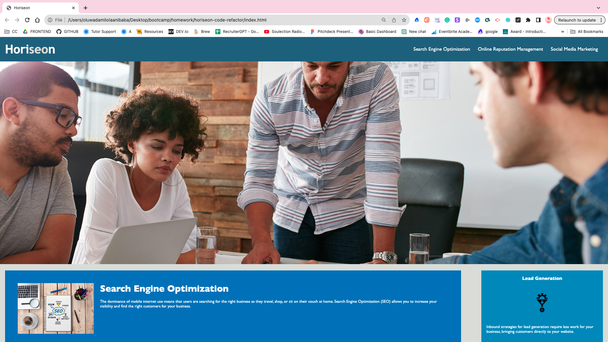

# horiseon-code-refactor

## Description  
This project is to enhance the accessibility of the Horiseon website. The primary aim is to facilitate ease of access for individuals with disabilities through the incorporation of alt text.

This project contains HTML that was updated from 'div' elements to semantic HTML. Additionally the CSS has been updated to target the correct elements. Lastly, the classes in the CSS has been consilidate to target multiple selctors.

## Business Advantages
Beyond the ethical imperative, fostering a more accessible website provides distinct advantages for businesses: -

1. Enhanced Search Engine Optimisation:
Elevate the digital footprint of Horiseon through heightened Search Engine Optimisation, increasing online visibility and reach.

2. Mitigation of Legal Risks:
Proactively avoid potential legal ramifications associated with inaccessible digital content, safeguarding the brand from litigation.

## Usage 

This site will be used by Horiseon customers to understand more about the services they offer.

Example of webpage below: 

## Credits

## Tutorials used:
1. https://www.w3schools.com/html/html5_semantic_elements.asp
2. https://www.w3schools.com/tags/att_img_alt.asp

## License

MIT Licensed 

---
